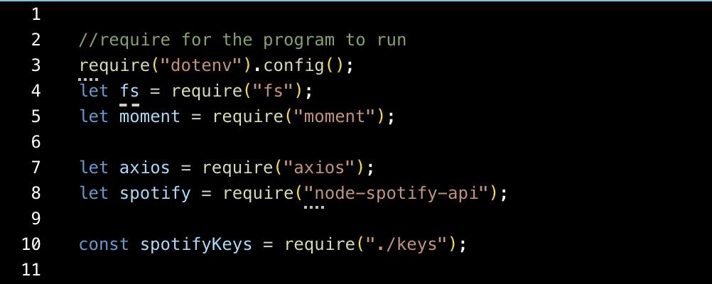
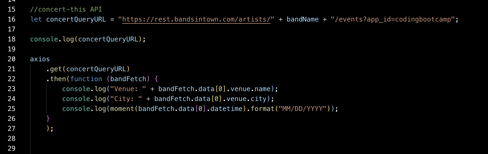
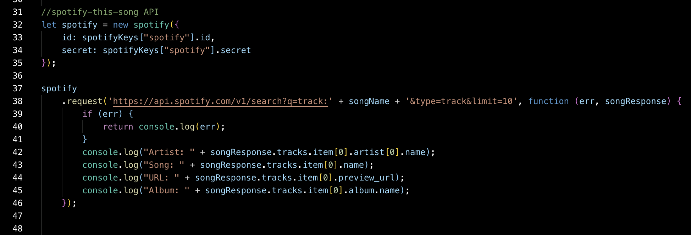
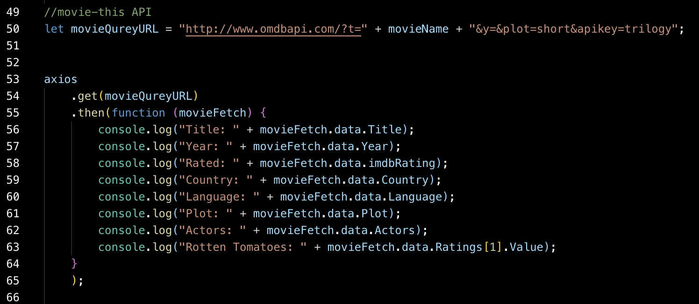
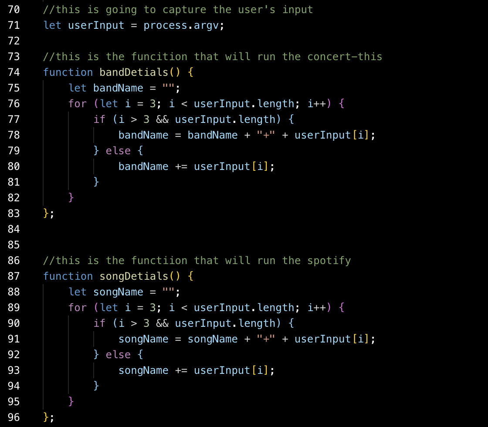
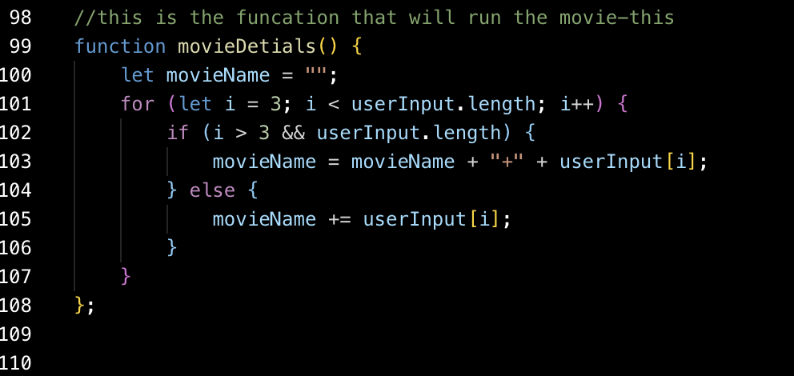
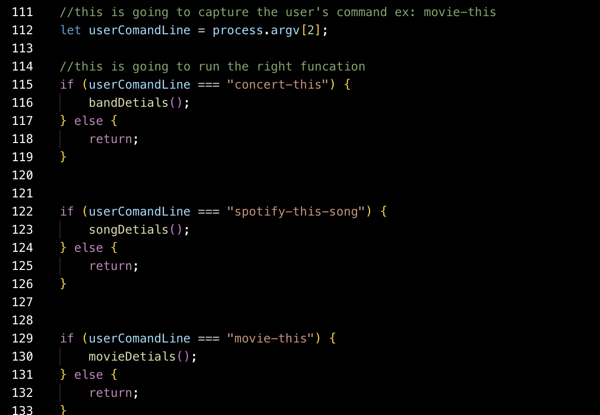

# LIRIAPP

Meet Liri! Your personal bot that will search Spotify for songs, Bands in Town for concerts, and OMDB for movies. 

Deployed Link: https://callibonnet.github.io/LIRIAPP/

unfortunately the code is not working properly... But it was an attmept! 

Image one: This image shows all of the required items needed to run this code 

Image two: We are now looking at the concert-this API 

Image three: We are now looking at the Spotify this API (this was sooo hard!) 

Image four: We are now looking at the movie-this API 

Image five: We are now starting to git into the funcations that will run the API's

Image six: One more image, becuase my screenshot was not large enough 

Image seven:(the final image!) We are now looking at the if/else funcation that takes the user's command and runs the right funcation. 

